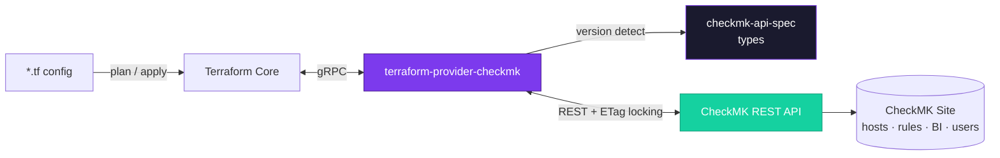
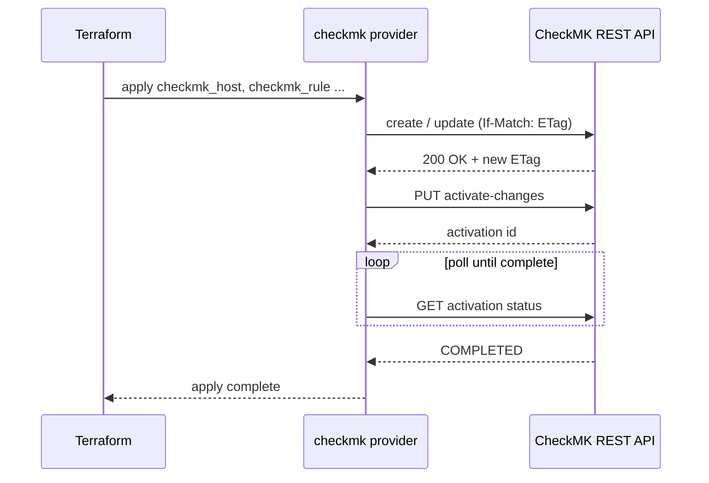

<a id="top"></a>
<div align="center">


<br/>

<!-- brand badges: official colors -->
[](go.mod)
[](#installation)
[](#version-compatibility)
[](LICENSE)

<br/>

<!-- status row: purple accent -->
[](https://github.com/withakedo/terraform-provider-checkmk/actions/workflows/test.yml)
[](https://github.com/withakedo/terraform-provider-checkmk/releases)
[](https://registry.terraform.io/providers/withakedo/checkmk)


<p><b>Manage hosts, folders, users, rules, BI aggregations, and distributed monitoring — all as Terraform state.</b></p>

<p>
<a href="#features"></a>
<a href="#architecture"></a>
<a href="#quick-start"></a>
<a href="#resources"></a>
<a href="#version-compatibility"></a>
<a href="#development"></a>
</p>

</div>

<br/>

> [!NOTE]
> **Fork notice:** This project is a fork of [BlackMesaLTD/terraform-provider-checkmk](https://github.com/BlackMesaLTD/terraform-provider-checkmk), licensed under the [Mozilla Public License 2.0](LICENSE). It continues development independently under [withakedo/terraform-provider-checkmk](https://github.com/withakedo/terraform-provider-checkmk), including ongoing compatibility updates for newer CheckMK releases. All credit for the original implementation goes to the upstream authors. Maintained by [Withake-IT](https://withake-it.de).

<br/>

## Features

<table>
<tr>
<td width="33%" valign="top">

**Type Safety**
- OpenAPI-driven validation from real CheckMK schemas
- Plan-time checks — bad field/enum values fail at `plan`, not `apply`
- Version-aware handling across CheckMK 2.2.x → 2.5.x
- Falls back gracefully to `hollow` mode on unknown versions

</td>
<td width="33%" valign="top">

**Safe Concurrency**
- ETag-based optimistic locking on every write
- Serialized activation calls — no more concurrent-apply `423` errors
- Real polling for activation completion, not fire-and-forget
- Full CRUD for hosts, folders, users, rules, and more

</td>
<td width="33%" valign="top">

**Operate at Scale**
- `checkmk_hosts_bulk` — 1 API call for many hosts instead of N
- Distributed monitoring via `checkmk_site_connection`
- Business Intelligence rollups via `checkmk_bi_aggregation`
- Import support to bring existing config under Terraform

</td>
</tr>
</table>

<details>
<summary><b>Related projects</b></summary>
<br/>

This provider uses generated types from a companion repository:

| Repository | Purpose |
|------------|---------|
| [checkmk-api-spec](https://github.com/BlackMesaLTD/checkmk-api-spec) | OpenAPI specs and generated Go types for the CheckMK REST API |

`checkmk-api-spec` provides:
- **42 baseline packages** covering all API variations across CheckMK versions
- **Runtime version mapping** — any CheckMK version maps to correct types
- **Field validators** — enum values, required fields, type information
- **Union descriptions** — merged field documentation with version annotations

</details>

<div align="right"><a href="#top">↑ back to top</a></div>

<br/>

## Architecture



<details>
<summary><b>How an <code>apply</code> reaches CheckMK</b></summary>
<br/>



Activation calls are serialized provider-side, so concurrent `checkmk_activation` resources queue up instead of racing into CheckMK's `423 Locked` response.

</details>

<div align="right"><a href="#top">↑ back to top</a></div>

<br/>

## Requirements

| | |
|---|---|
| **Terraform** | `>= 1.0` |
| **CheckMK** | `2.2.x` · `2.3.x` · `2.4.x` · `2.5.x` with REST API enabled |
| **Go** | `>= 1.21` *(development only)* |

<br/>

## Installation

```hcl
terraform {
  required_providers {
    checkmk = {
      source  = "withakedo/checkmk"
      version = "~> 0.1"
    }
  }
}
```

<br/>

## Authentication

Create an automation user in CheckMK:

1. Navigate to **Setup → Users → Users**
2. Click **Add user**
3. Select **Automation user (for scripts, API access)**
4. Note the **username** and **automation secret**

<br/>

## Provider Configuration

```hcl
provider "checkmk" {
  url      = "https://monitoring.example.com/mysite"
  username = "automation"
  password = var.checkmk_password

  # Optional settings
  activate                = "auto"  # "auto" or "manual" (default: "manual")
  strict_resource_locking = true    # Use ETags for optimistic locking
  request_timeout         = 60      # API timeout in seconds
  long_operation_timeout  = 1800    # Timeout for activation/service discovery (default: 1800)
  max_retries             = 3       # Retry count for transient failures
  insecure_skip_verify    = false   # Skip TLS verification (not recommended)
}
```

> [!TIP]
> Environment variables are also supported: `CHECKMK_URL`, `CHECKMK_USERNAME`, `CHECKMK_PASSWORD`

<div align="right"><a href="#top">↑ back to top</a></div>

<br/>

## Resources

<details open>
<summary><b>Configuration</b></summary>

| Resource | Description |
|----------|-------------|
| `checkmk_folder` | Hierarchical folder structure for organizing hosts |
| `checkmk_tag_group` | Host tag groups with predefined choices |
| `checkmk_aux_tag` | Auxiliary tags for tag group dependencies |
| `checkmk_time_period` | Time period definitions for rules and notifications |

</details>

<details open>
<summary><b>Hosts & Groups</b></summary>

| Resource | Description |
|----------|-------------|
| `checkmk_host` | Monitored hosts with attributes, tags, and labels |
| `checkmk_hosts_bulk` | Manages many hosts via CheckMK's bulk-create/update/delete endpoints (1 API call per operation) |
| `checkmk_host_group` | Logical groupings of hosts |
| `checkmk_service_group` | Logical groupings of services |

</details>

<details>
<summary><b>Users & Access</b></summary>

| Resource | Description |
|----------|-------------|
| `checkmk_user` | User accounts with roles and contact settings |
| `checkmk_contact_group` | Contact groups for notifications |
| `checkmk_password` | Stored credentials for integrations |

</details>

<details>
<summary><b>Rules</b></summary>

| Resource | Description |
|----------|-------------|
| `checkmk_rule` | Generic rule resource for any CheckMK ruleset |
| `checkmk_notification_rule` | Notification routing and filtering rules |
| `checkmk_host_labels` | Host label rules |
| `checkmk_service_labels` | Service label rules |

</details>

<details>
<summary><b>Rule Wrappers</b> <i>(typed, simplified interfaces for common rule types — 26 total)</i></summary>

**Hosts**

| Resource | Description |
|----------|-------------|
| `checkmk_host_check_interval` | Host check interval configuration |
| `checkmk_host_check_period` | Host check period configuration |
| `checkmk_host_check_commands` | Host check command configuration |
| `checkmk_host_max_check_attempts` | Host check retry configuration |
| `checkmk_host_retry_interval` | Host retry interval configuration |
| `checkmk_host_notification_period` | Host notification time periods |
| `checkmk_host_first_notification_delay` | Delay before the first host notification |
| `checkmk_host_notification_interval` | Interval between repeated host notifications |
| `checkmk_host_notification_options` | Host state changes that trigger notifications |
| `checkmk_host_notifications_enabled` | Enables or disables notifications for hosts |

**Services**

| Resource | Description |
|----------|-------------|
| `checkmk_service_check_interval` | Service check interval configuration |
| `checkmk_service_check_period` | Service check period configuration |
| `checkmk_service_max_check_attempts` | Service check retry configuration |
| `checkmk_service_retry_interval` | Service retry interval configuration |
| `checkmk_service_custom_rule` | Custom service rules |
| `checkmk_service_active_checks_enabled` | Enables or disables active checks for services |
| `checkmk_service_passive_checks_enabled` | Enables or disables passive checks for services |
| `checkmk_service_process_perf_data` | Enables or disables performance data processing for services |
| `checkmk_service_notification_period` | Service notification time periods |
| `checkmk_service_first_notification_delay` | Delay before the first service notification |
| `checkmk_service_notification_interval` | Interval between repeated service notifications |
| `checkmk_service_notification_options` | Service state changes that trigger notifications |
| `checkmk_service_notifications_enabled` | Enables or disables notifications for services |
| `checkmk_service_flap_detection_enabled` | Enables or disables flap detection for services |
| `checkmk_custom_service_attributes` | Custom attributes for services |

**Agent Configuration**

| Resource | Description |
|----------|-------------|
| `checkmk_agent_config_mrpe` | MRPE (MK's Remote Plugin Executor) checks for the CheckMK agent — requires agent baking |

</details>

<details>
<summary><b>Operations</b></summary>

| Resource | Description |
|----------|-------------|
| `checkmk_activation` | Explicit activation checkpoint for staged changes |
| `checkmk_service_discovery` | Triggers service discovery for a host |
| `checkmk_downtime` | Schedules a host or service maintenance window |
| `checkmk_acknowledge` | Acknowledges the current problem state of a host or service |
| `checkmk_comment` | Adds a comment to a host or service |

</details>

<details>
<summary><b>Business Intelligence</b></summary>

| Resource | Description |
|----------|-------------|
| `checkmk_bi_aggregation` | Health-status rollup computed from a tree of hosts/services |

</details>

<details>
<summary><b>Distributed Monitoring</b></summary>

| Resource | Description |
|----------|-------------|
| `checkmk_site_connection` | Connects a remote monitoring site to this site |

</details>

<details>
<summary><b>Data Sources</b></summary>

| Data Source | Description |
|-------------|-------------|
| `checkmk_host` | Look up an existing host and its attributes |
| `checkmk_folder` | Look up an existing folder |
| `checkmk_host_group` | Look up an existing host group |
| `checkmk_service_group` | Look up an existing service group |
| `checkmk_user` | Look up an existing user account |
| `checkmk_contact_group` | Look up an existing contact group |
| `checkmk_password` | Look up an existing stored credential |
| `checkmk_aux_tag` | Look up an existing auxiliary tag |
| `checkmk_tag_group` | Look up an existing host tag group |
| `checkmk_time_period` | Look up an existing time period |
| `checkmk_rule` | Look up an existing rule by ID |
| `checkmk_notification_rule` | Look up an existing notification rule by ID |
| `checkmk_downtimes` | List active downtimes on a host (drift detection for `checkmk_downtime`) |
| `checkmk_comments` | List comments on a host (drift detection for `checkmk_comment`) |

</details>

<div align="right"><a href="#top">↑ back to top</a></div>

<br/>

## Quick Start

### Create a Folder and Host

```hcl
resource "checkmk_folder" "production" {
  path  = "/Production"
  title = "Production Systems"
}

resource "checkmk_host" "web_server" {
  name   = "web-01.example.com"
  folder = checkmk_folder.production.path

  ipaddress = "10.1.2.3"
  alias     = "Production Web Server"

  labels = {
    environment = "production"
    team        = "platform"
  }
}
```

### Create a Rule with Conditions

```hcl
resource "checkmk_service_check_interval" "critical_services" {
  interval    = 60
  description = "1-minute check interval for critical services"

  conditions {
    host_labels = {
      environment = "production"
    }
    service_labels = {
      critical = "true"
    }
  }
}
```

### Manage Activation Explicitly

```hcl
provider "checkmk" {
  # ... credentials ...
  activate = "manual"  # Don't auto-activate
}

resource "checkmk_host" "servers" {
  for_each = var.servers
  # ... host configuration ...
}

# Activate all changes at once
resource "checkmk_activation" "deploy" {
  depends_on = [checkmk_host.servers]

  # Re-activate when hosts change
  triggers = {
    hosts = md5(jsonencode(checkmk_host.servers))
  }
}
```

<div align="right"><a href="#top">↑ back to top</a></div>

<br/>

## Version Compatibility

| CheckMK Version | Support Status |
|:-:|:-:|
| `2.5.x` | Fully supported |
| `2.4.x` | Fully supported |
| `2.3.x` | Fully supported |
| `2.2.x` | Fully supported |

The provider automatically detects the CheckMK version and adjusts API calls accordingly. Type validation relies on generated types from [checkmk-api-spec](https://github.com/BlackMesaLTD/checkmk-api-spec), which ships baseline types for specific patch releases per minor version; unlisted patch releases automatically fall back to the newest known baseline for that minor version.

> [!IMPORTANT]
> If you connect to a CheckMK version newer than any known baseline (e.g. a brand new minor release), the provider falls back to `type_mode = "hollow"` with a warning instead of failing — resources are still fully functional, just without plan-time field/enum validation until the companion spec repo (and this provider's dependency on it) is updated.

<br/>

## Current Limitations

<details>
<summary><b>API Coverage</b></summary>
<br/>

- **Partial resource coverage** — Not all CheckMK REST API endpoints are implemented yet. Priority has been given to hosts, folders, users, and rules.
- **Partial data source coverage** — Data sources exist for the most commonly-referenced object types (hosts, folders, groups, users, rules, etc. — see the table above), but not every resource type has a matching data source yet.

</details>

<details>
<summary><b>Validation</b></summary>
<br/>

- **Plan-time validation** — Enum values of known fields (like `tag_agent`) are validated during `terraform plan` when connected to CheckMK. Invalid values produce errors before apply.
- **Custom attributes** — The `attributes` map is open: user-defined custom attributes are accepted without a prefix and passed straight through to the API, which is the source of truth for whether they exist. Keys that aren't built-in fields are validated by the API at apply time.
- **Built-in tag groups** — Built-in host tag groups may be written with or without the `tag_` prefix (e.g. `agent` or `tag_agent`); the provider promotes the unprefixed form to the API automatically and keeps your configured key in state. Custom tag groups should be written with the explicit `tag_` prefix.
- **Hollow mode** — Set `type_mode = "hollow"` to skip plan-time validation entirely (useful for testing or when version types are unavailable).

</details>

<details>
<summary><b>Rules</b></summary>
<br/>

- **Complex rule values** — Some rule value types with deeply nested structures may require JSON encoding in the `value` attribute.
- **Rule ordering** — Rule order within a ruleset is managed but bulk reordering operations are not atomic.

</details>

<details>
<summary><b>Operations</b></summary>
<br/>

- **Activation scope** — Activation applies to all pending changes, not just Terraform-managed resources.
- **Bulk hosts: no folder moves, not transactional** — `checkmk_hosts_bulk` doesn't support moving a host between folders after creation (matching `checkmk_host`). CheckMK's bulk endpoints also aren't transactional: a partially-failing bulk-create/update can leave some hosts created/updated on the CheckMK side without Terraform recording it in state — the error message lists which host names succeeded and failed; reconcile manually.
- **Site connections: configuration only** — `checkmk_site_connection` manages the connection's configuration but does not perform the separate remote-site login/logout actions, which exchange admin credentials for the remote site. Log in via the CheckMK UI or API after creating a connection if replication is enabled.
- **BI aggregations and site connections: raw JSON body** — `checkmk_bi_aggregation` and `checkmk_site_connection` take their configuration as a JSON-encoded string (`definition_raw` / `config_raw`) rather than a typed schema, since both underlying CheckMK schemas are large, deeply nested, and highly variable — the same approach `checkmk_rule` uses for `value_raw`. On read, these fields are refreshed from the API's response, which may include CheckMK-filled defaults you didn't specify; if those defaults don't round-trip byte-for-byte through `jsonencode`, this can show a perpetual diff until you add the defaulted fields explicitly.
- **Service discovery is not re-readable** — `checkmk_service_discovery` triggers a discovery run and records its result, but (like `checkmk_activation`) has no persistent server-side object to read back; drift in a host's discovered services is not detected automatically. Re-run `terraform apply` to re-trigger discovery.
- **Downtimes: host and service only, no in-place modify** — `checkmk_downtime` supports `host` and `service` downtime types; `hostgroup`, `servicegroup`, and query-based downtimes are not yet implemented. Every attribute forces replacement on change, since CheckMK's downtime create endpoints don't return a lookup-friendly id to target with the separate "modify downtime" endpoint. Deleting the resource cancels the downtime by host/service parameters rather than by CheckMK's internal downtime id.
- **Acknowledgements and comments: host and single service only, no in-place modify** — `checkmk_acknowledge` and `checkmk_comment` support a single host or a single service on a host; `hostgroup`, `servicegroup`, and query-based targets are not yet implemented. Every attribute forces replacement on change, for the same reason as `checkmk_downtime` — CheckMK's create endpoints don't return a lookup-friendly id. Deleting either resource removes the acknowledgement/comment by host/service parameters rather than by CheckMK's internal id.

</details>

<details>
<summary><b>Version Differences</b></summary>
<br/>

- **Schema variations** — Some attributes are only available in certain CheckMK versions. The provider accepts all attributes but the API may reject version-incompatible values.
- **Enum value changes** — Valid enum values (like `tag_agent` choices) vary between versions. The union descriptions document these differences.

</details>

<div align="right"><a href="#top">↑ back to top</a></div>

<br/>

## Development

<p>

</p>

### Building

```bash
go build -o terraform-provider-checkmk
```

### Testing

```bash
# Unit tests
go test ./...

# Acceptance tests (requires running CheckMK instance)
TF_ACC=1 \
CHECKMK_URL="http://localhost:5000/mysite" \
CHECKMK_USERNAME="automation" \
CHECKMK_PASSWORD="secret" \
go test -v ./internal/provider -timeout 30m
```

### Local Development

```bash
# Add to ~/.terraformrc
cat >> ~/.terraformrc <<EOF
provider_installation {
  dev_overrides {
    "withakedo/checkmk" = "/path/to/terraform-provider-checkmk"
  }
  direct {}
}
EOF
```

<div align="right"><a href="#top">↑ back to top</a></div>

<br/>

## Documentation

| | |
|---|---|
| [CHANGELOG](CHANGELOG.md) | Notable changes to this provider |
| [CheckMK REST API Documentation](https://docs.checkmk.com/latest/en/rest_api.html) | Upstream API reference |
| [Terraform Plugin Framework](https://developer.hashicorp.com/terraform/plugin/framework) | Framework this provider is built on |
| [checkmk-api-spec Repository](https://github.com/BlackMesaLTD/checkmk-api-spec) | Generated types and version mappings |

<br/>

## License

This project is licensed under the **Mozilla Public License 2.0** — see the [LICENSE](LICENSE) file for details.

<br/>

<div align="center">

<a href="https://github.com/withakedo/terraform-provider-checkmk/graphs/contributors">
  
</a>

<br/><br/>


</div>
